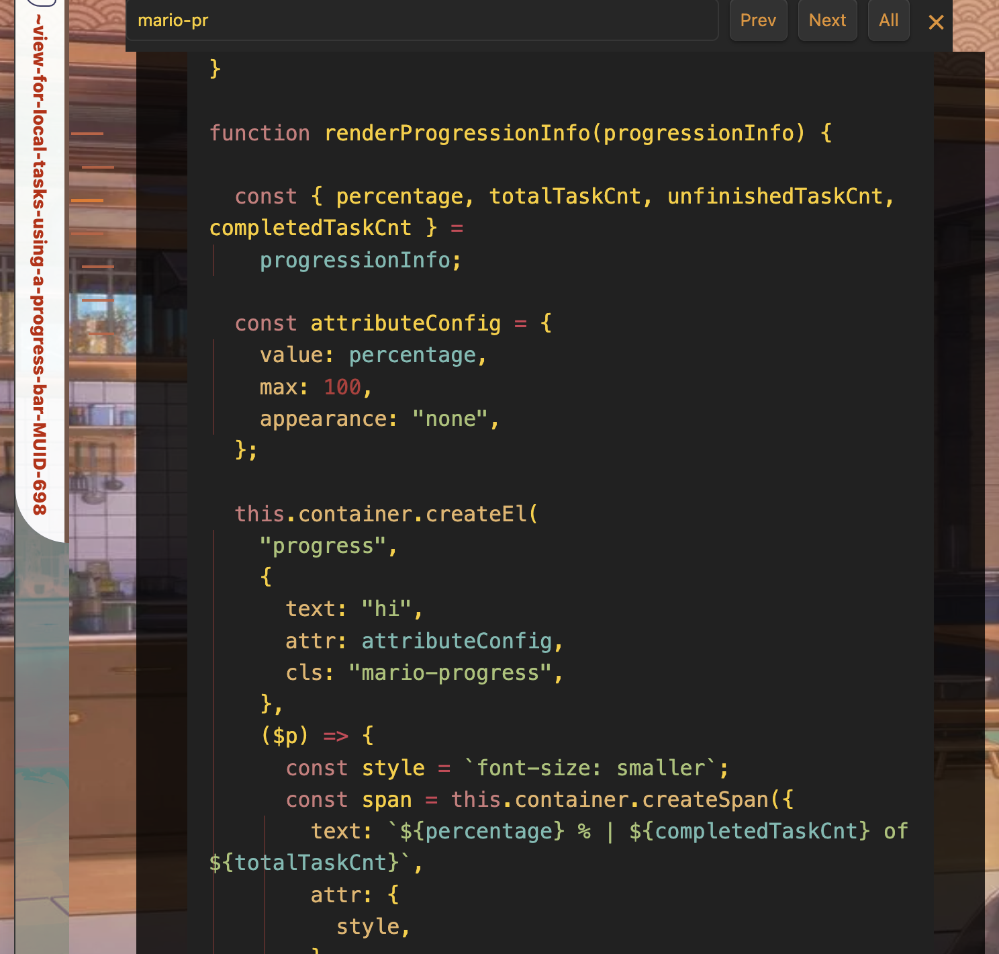

---
---

# -

## About

This readme explains what types of files should be housed.

# =

## Summary

This experiments folder is specifically designed to house any codelet in obsidianmd that uses custom classes.

## Examples And Counter Examples

The codelet creates an element with a specific class called .mario-progress so that custom styling can be applied.
